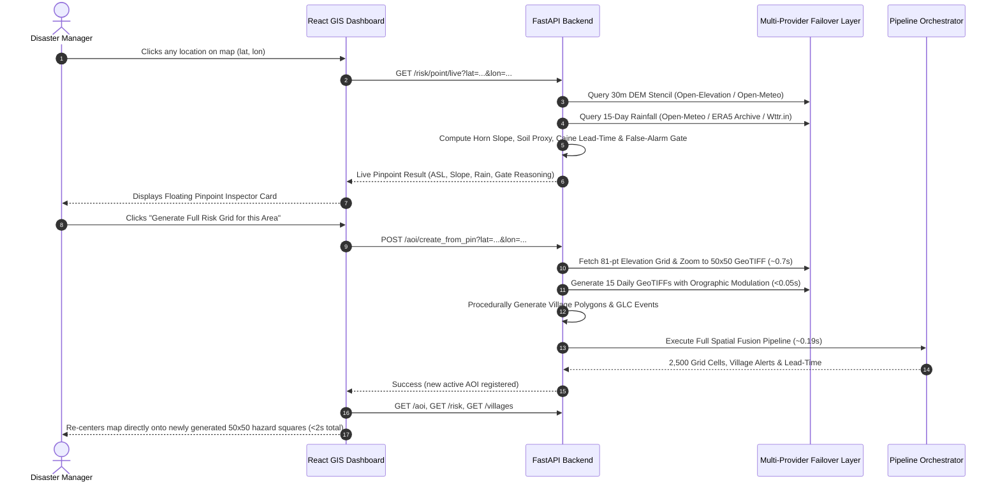

# TerraSharp (SH-304) System Architecture & Data Flow

## 1. High-Level Architecture Overview

The **TerraSharp (SH-304) Hyper-Local Landslide & Flash-Flood Early Warning System** is an end-to-end geospatial data-fusion platform designed to ingest multi-source planetary observations, normalize spatial grids, extract terrain and hydrometeorological features, compute transparent weighted risk indices, estimate warning lead-times via empirical thresholds, generate actionable settlement-level alerts, and serve the outputs through a high-performance REST API and interactive GIS dashboard.

```mermaid
flowchart TD
    subgraph Data_Sources["1. Multi-Source Ingestion & Global Failover"]
        SRTM["SRTM GL1 30m / Open-Elevation / Open-Meteo<br/>Digital Elevation Model"]
        GPM["NASA GPM IMERG v07 / Open-Meteo / ERA5 Archive / Wttr.in<br/>Precipitation Series"]
        GLC["NASA Global Landslide Catalog (GLC) / GSI<br/>Historical Inventory"]
        ADMIN["Survey of India / OSM<br/>Village Cadastral Boundaries"]
    end

    subgraph Preprocessing["2. Spatial Normalization & Common Grid"]
        AOI["AOI Extraction & CRS Reprojection<br/>(WGS84 EPSG:4326 + UTM Projection)"]
        GRID["Analysis Grid Generation<br/>(~1.1 km / 0.01° Uniform Cell Matrix: 50x50 = 2,500 cells)"]
        RESAMPLE["Bilinear & Orographic Elevation-Informed Resampling<br/>& Grid Alignment"]
    end

    subgraph Feature_Engineering["3. Physical Feature Derivation"]
        TERRAIN["Terrain Gradient Engine<br/>• Horn (1981) 3x3 Slope (°)<br/>• D8 Flow Routing & Accumulation"]
        RAIN["Precipitation Accumulation<br/>• 24h Storm Rainfall & Current Intensity<br/>• 3-day & 15-day Rolling Accumulations<br/>• Rate of Intensification (dI/dt)"]
        SOIL["15-Day Exponential Decay Soil Saturation Proxy<br/>AMI = Σ R_k · 0.85^k<br/>[STRICTLY PROXY]"]
        HIST["Historical Hazard Predisposition<br/>Gaussian KDE + Neutral Median Imputation"]
    end

    subgraph Scoring_and_Mitigation["4. Risk Scoring & Physical Mitigation"]
        WINDEX["Weighted Landslide Risk Index<br/>w_rain·S_rain + w_slope·S_slope +<br/>w_soil·S_soil + w_hist·S_hist"]
        FFINDEX["Flash-Flood Concentration Index<br/>0.50·S_rain + 0.30·(1 - S_slope) + 0.20·S_soil"]
        GATE["Physical False-Alarm Mitigation Gate<br/>• Slope < 15° Clamping Factor<br/>• Unsaturated Matrix Suction Buffer<br/>• High-Concurrence Catastrophic Boost"]
        LEAD["Lead-Time Estimator<br/>Caine (1980) I_crit = 14.82·D^-0.39<br/>Dynamic Trend Extrapolation"]
    end

    subgraph Spatial_Aggregation["5. Settlement & Regional Aggregation"]
        VILLAGES["Spatial Join & Polygon Aggregation<br/>Mean Risk, Peak Risk, % Critical Hazard Area"]
        ALERTS["Tiered Alert State Machine<br/>NORMAL | WATCH | WARNING | CRITICAL<br/>Simulated Evacuation Guidelines"]
        BACKTEST["Historical Validation Suite<br/>Rain-Only Baseline vs Full Weighted Index"]
    end

    subgraph Delivery_Interfaces["6. Delivery & Visualization"]
        FASTAPI["FastAPI Backend (Uvicorn)<br/>Typed REST Endpoints + In-Memory PipelineState"]
        REACT["React 18 + Leaflet GIS Dashboard<br/>50x50 Risk Squares + Satellite Hybrid Basemap"]
        PIN_INSPECT["Live Floating Pinpoint Inspector<br/>Real-Time 30m Stencil & <2s Hazard Grid Generator"]
        EXPORTS["Situation Reports (SITREP)<br/>GeoJSON, JSON & Markdown"]
    end

    Data_Sources --> Preprocessing
    Preprocessing --> Feature_Engineering
    Feature_Engineering --> Scoring_and_Mitigation
    Scoring_and_Mitigation --> Spatial_Aggregation
    Spatial_Aggregation --> Delivery_Interfaces
```

---

## 2. Component Architecture & Data Flow

### 2.1 Backend Pipeline Execution Lifecycle

The central orchestrator [`PipelineOrchestrator`](file:///D:/landslide_proto/backend/app/pipeline.py) coordinates the spatial data-fusion process in strict dependency order:

1. **Grid Initialization (`AnalysisGrid`):** Computes bounds, step sizes ($\Delta \text{lon} = \Delta \text{lat} = 0.01^\circ$), affine geotransform, and 1D/2D coordinate arrays for the active AOI bounding box.
2. **DEM Ingestion & Reprojection (`DEMIngestionClient`):** Loads the georeferenced GeoTIFF and resamples to the `AnalysisGrid` using bilinear interpolation.
3. **Hydrological & Terrain Derivation (`compute_slope_and_aspect`, `compute_d8_flow_accumulation`):**
   - Projects metric coordinates to UTM to obtain true $\Delta x, \Delta y$ in meters.
   - Computes Horn 1981 partial derivatives $\frac{\partial z}{\partial x}, \frac{\partial z}{\partial y}$ for slope angle in degrees and aspect azimuth.
   - Computes steepest-descent flow direction matrix and runs topological sorting to accumulate upstream contributing catchment area.
4. **Rainfall Processing (`RainfallProcessor`):**
   - Resamples 15 daily GeoTIFFs to target grid resolution.
   - Computes rolling $R_{24\text{h}}$, $R_{3\text{d}}$, $R_{15\text{d}}$, current hourly intensity $I_0$, and rate of change $\alpha = \frac{dI}{dt}$.
5. **Soil Moisture Saturation Proxy (`compute_soil_saturation_proxy`):**
   - Computes 15-day Antecedent Moisture Index: $\text{AMI} = \sum_{k=0}^{14} R_k \cdot (0.85)^k$.
   - Normalizes to $[0, 1]$ over the $250\text{ mm}$ soil capacity threshold.
6. **Historical Landslide Density (`compute_historical_landslide_density`):**
   - Computes 2D Gaussian KDE from NASA GLC point events.
   - Imputes missing unrecorded zones with the AOI-median density.
7. **Hazard Index Scoring (`LandslideRiskScorer`, `FlashFloodRiskScorer`):**
   - Evaluates multi-factor weighted landslide risk: $0.35 \cdot R + 0.30 \cdot S + 0.20 \cdot \text{Soil} + 0.15 \cdot \text{GLC}$.
   - Evaluates flash-flood topographic concentration index: $0.50 \cdot R + 0.30 \cdot (1 - S) + 0.20 \cdot \text{Soil}$.
8. **Empirical Lead-Time Evaluation (`evaluate_caine_lead_time`):**
   - Evaluates Caine (1980) critical intensity $I_{\text{crit}} = 14.82 \cdot D^{-0.39}$.
   - Projects lead-time to threshold based on trend $\alpha$.
9. **Village Boundary Aggregation (`aggregate_grid_to_villages`):**
   - Performs spatial point-in-polygon assignment for all 2,500 grid cells.
   - Derives village mean risk, peak risk, and percentage of settlement area exceeding critical risk ($>0.75$).
10. **Alert Engine & Evacuation Decision Support (`AlertEngine`):**
    - Triggers tiered alerts (`NORMAL`, `WATCH`, `WARNING`, `CRITICAL`) with simulated operational guidelines.
11. **In-Memory Cache Priming (`pipeline_state`):**
    - Retains all 2D numpy arrays, summaries, and GeoJSON vectors in RAM for instant, sub-millisecond REST API queries.

---

## 3. Real-Time Pinpoint & Dynamic AOI Architecture

In addition to pre-configured high-hazard mountain basins (Wayanad, Chamoli, Idukki, Shimla, Darjeeling, Nilgiris), TerraSharp allows users to pin **any coordinate on Earth**:

---

## 4. Multi-Provider Failover & Non-Blocking Design

To eliminate the rate-limiting bottlenecks (e.g. Open-Meteo HTTP 429) that previously froze synchronous server threads:
- **No Blocking Sleeps:** All `time.sleep(62.0)` loops were completely eliminated.
- **Fail-Fast Timeouts:** HTTP requests carry strict timeouts (2.5s–3.5s) with 0 retry pauses.
- **Open-Elevation Global SRTM Primary:** Batch-fetches 81 coordinates in a single ~0.7s call without API key or rate-limit throttle.
- **In-Memory Cache:** `LivePointFetcher._cache` retains recently queried coordinates for 60 seconds.
- **Topographically-Informed Orographic Rainfall:** Uses the real 15-day regional precipitation series and applies physical elevation lapse rate weighting ($\pm 15\%$) across the DEM to generate all 15 daily GeoTIFFs in under 50 milliseconds.

---

## 5. Frontend Architecture & Leaflet GIS Engine

The frontend is a single-page application built on **React 18**, **TypeScript**, and **Leaflet 1.9**:

### 5.1 Map Layer Stack (`MapViewer.tsx`)
1. **Basemap Layer Group:**
   - **Satellite Hybrid:** `Esri.World_Imagery` + `Esri.World_Boundaries_and_Places` reference layer. Cities, towns, boundaries, and roads are clearly rendered over high-resolution satellite imagery.
   - **Dark Canvas:** `Esri.Canvas.World_Dark_Gray_Base` + `World_Dark_Gray_Reference`.
   - **OpenStreetMap:** Standard OSM street cartography.
2. **Hazard Grid Layer Group:**
   - Renders all 2,500 cells as individual Leaflet rectangles ($0.01^\circ \times 0.01^\circ$).
   - Dynamic fill color based on active raster layer (`landslide`, `flash_flood`, `slope`, `rainfall`, `soil_proxy`).
   - Sticky tooltips displaying live metrics upon mouse hover.
3. **Village Polygon Layer Group:**
   - Administrative boundaries rendered from GeoJSON.
   - Boundary stroke color reflects alert state: `#ef4444` (`CRITICAL`), `#f97316` (`WARNING`), `#38bdf8` (`NORMAL`).
4. **Historical GLC Layer Group:**
   - Circle markers indicating cataloged landslide events with size/fatality popups.
5. **Pinned Location Marker:**
   - Interactive pulsed marker showing pinned coordinate.

---

## 6. Testing & Quality Assurance Architecture

The test suite in [`tests/`](file:///D:/landslide_proto/tests/) covers unit models, physical derivations, and API endpoints:
- `test_api.py`: Integration tests for all REST endpoints using FastAPI TestClient with lifespan context.
- `test_grid.py`: AnalysisGrid cell dimensions, geotransforms, and coordinate lookups.
- `test_terrain.py`: Horn 1981 slope gradients on flat planes and known mathematical inclines; D8 flow routing.
- `test_soil_proxy.py`: 15-day Antecedent Moisture Index decay bounds and saturation limits.
- `test_scoring.py`: Multi-factor risk index weights, boundary conditions, and explainability breakdowns.
- `test_leadtime.py`: Caine (1980) threshold evaluation and state machine alert transitions.
- `test_live_pinpoint.py`: Live point fetcher slope geometry, rainfall extraction, and false-alarm gate logic.

All 23 tests execute in under 14 seconds via `python -m pytest -v`.
