# SH-304 System Architecture & Data Flow

## 1. High-Level Architecture Overview

The **SH-304 Hyper-Local Landslide & Flash-Flood Early Warning System** is an end-to-end data-fusion platform designed to ingest multi-source geospatial observations, normalize spatial grids, extract terrain and hydrometeorological features, compute transparent weighted risk indices, estimate warning lead-times via empirical thresholds, generate actionable settlement-level alerts, and serve the outputs through a high-performance REST API and interactive GIS dashboard.

```mermaid
flowchart TD
    subgraph Data_Sources["1. Multi-Source Ingestion"]
        GPM["NASA GPM IMERG v07<br/>Final Daily Precipitation"]
        SRTM["SRTM GL1 30m / Copernicus<br/>Digital Elevation Model"]
        GLC["NASA Global Landslide Catalog<br/>Historical Inventory"]
        ADMIN["Survey of India / OSM<br/>Village Cadastral Boundaries"]
    end

    subgraph Preprocessing["2. Spatial Normalization & Common Grid"]
        AOI["AOI Extraction & CRS Reprojection<br/>(WGS84 EPSG:4326 + UTM Projection)"]
        GRID["Analysis Grid Generation<br/>(~1 km / 0.01° Uniform Cell Geometry)"]
        RESAMPLE["Bilinear / Area-Weighted Resampling<br/>& Alignment"]
    end

    subgraph Feature_Engineering["3. Physical Feature Derivation"]
        TERRAIN["Terrain Gradient Engine<br/>• Horn 3x3 Slope (°)<br/>• D8 Flow Accumulation"]
        RAIN["Precipitation Accumulation<br/>• 24h Rainfall & Intensity<br/>• 3-day & 15-day Rolling Sums<br/>• Trend Rate (dI/dt)"]
        SOIL["Soil Saturation Proxy<br/>AMI = f(R_3d, R_15d, decay)<br/>[STRICTLY PROXY]"]
        HIST["Historical Density Kernel<br/>Gaussian KDE + Neutral Median Imputation"]
    end

    subgraph Scoring_and_Alerts["4. Risk Scoring & Early Warning"]
        WINDEX["Weighted Landslide Risk Index<br/>w_rain·S_rain + w_slope·S_slope +<br/>w_soil·S_soil + w_hist·S_hist"]
        FFINDEX["Flash-Flood Concentration Index<br/>w_rain·S_rain + w_drain·S_drain +<br/>w_valley·(1 - S_slope)"]
        LEAD["Lead-Time Estimator<br/>Caine (1980) I = 14.82·D^-0.39<br/>Trend Extrapolation"]
        ALERT["Alert State Machine<br/>NORMAL | WATCH | WARNING | CRITICAL<br/>Simulated Evacuation Guidelines"]
    end

    subgraph Spatial_Aggregation["5. Settlement & Regional Aggregation"]
        VILLAGES["Spatial Join & Polygon Aggregation<br/>Mean Risk, Peak Risk, % Critical Area"]
        BACKTEST["Historical Validation Suite<br/>Rain-Only Baseline vs Full Weighted Index"]
    end

    subgraph Delivery_Interfaces["6. Delivery & Visualization"]
        FASTAPI["FastAPI Backend<br/>REST Endpoints + Pydantic Validation"]
        REACT["React + Leaflet GIS Dashboard<br/>Explainable Factor Inspection"]
        EXPORTS["Situation Reports<br/>GeoJSON, JSON & Markdown"]
    end

    Data_Sources --> Preprocessing
    Preprocessing --> Feature_Engineering
    Feature_Engineering --> Scoring_and_Alerts
    Scoring_and_Alerts --> Spatial_Aggregation
    Spatial_Aggregation --> Delivery_Interfaces
```



---

## 2. Directory Layout and Module Boundaries

```
sh304-landslide-warning/
├── backend/
│   ├── app/
│   │   ├── main.py                  # FastAPI bootstrap, CORS, lifespan priming
│   │   ├── config.py                # Pydantic settings & YAML loaders
│   │   ├── pipeline.py              # Central data fusion orchestrator & in-memory state
│   │   ├── models/                  # Domain enumerations & Pydantic schemas
│   │   ├── ingestion/               # NASA GPM, SRTM DEM, GLC, and Boundary clients
│   │   ├── preprocessing/           # Common AnalysisGrid, raster reprojection & normalization
│   │   ├── terrain/                 # Horn's slope, aspect & D8 flow routing
│   │   ├── rainfall/                # 24h, 3d, 15d rolling accumulations & intensity
│   │   ├── soil/                    # Antecedent soil moisture decay proxy
│   │   ├── history/                 # NASA GLC kernel density & neutral missing imputation
│   │   ├── scoring/                 # Weighted risk index & flash flood models
│   │   ├── leadtime/                # Caine (1980) threshold evaluation
│   │   ├── alerts/                  # Tiered alert generation & evacuation actions
│   │   ├── aggregation/             # Polygon spatial join & village aggregation
│   │   ├── backtest/                # Historical validation & baseline comparison
│   │   └── api/                     # Documented REST API route endpoints
├── frontend/                        # React 18 + TypeScript + Vite + Leaflet dashboard
├── configs/                         # Versioned YAML configurations (AOIs, weights, thresholds)
├── data/                            # Raw, processed, cache, and deterministic demo datasets
├── scripts/                         # CLI execution and sample data seed generator
├── tests/                           # Complete pytest test suite (19 passing unit & API tests)
└── docs/                            # In-depth architectural and operational documentation
```

---

## 3. Data Flow Stages

### Stage 1: Spatial Grid Alignment
Different earth observation instruments record data on incompatible grids (IMERG ~10 km, SRTM 30m). The `AnalysisGrid` establishes an exact common reference matrix (~1.1 km / 0.01° resolution) across the active Area of Interest (AOI). All layers are aligned, clipped, and reprojected to this common grid using bilinear interpolation for continuous terrain and area-weighted sampling for rainfall.

### Stage 2: Feature Engineering & Proxy Derivation
- **Terrain Gradient:** Horn's $3 \times 3$ finite-difference kernel yields slope steepness in degrees.
- **Drainage Routing:** D8 flow direction routes runoff downhill; topological accumulation counts upstream contributing catchment cells.
- **Antecedent Rainfall & Soil Proxy:** Computes short-term (3-day) and long-term (15-day) antecedent rainfall with exponential soil drainage decay ($k = 0.08$).
- **Susceptibility Density:** NASA GLC point records are smoothed via Gaussian KDE; unrecorded areas are imputed using the AOI-median baseline to avoid zero-hazard bias.

### Stage 3: Transparent Multi-Factor Risk Scoring
- **Landslide Index:** Combines rainfall trigger, terrain slope, antecedent soil proxy, and historical susceptibility via versioned weights.
- **Flash-Flood Index:** Combines recent storm deluge with upstream drainage concentration and valley bottom flatness.
- **Explainability:** Every grid cell and village retains full factor lineage, indicating the primary hazard driver and exact sub-score contributions.

### Stage 4: Lead-Time Modeling
Evaluates current storm intensity against the Caine (1980) global empirical threshold ($I_{\text{crit}} = 14.82 \times D^{-0.39}$). Computes estimated time to threshold breach under the current rainfall intensification rate $\frac{dI}{dt}$, accompanied by an empirical $\pm 30\%$ uncertainty interval.

### Stage 5: Settlement-Level Alert Generation & Aggregation
Grid cells are spatially joined with village administrative polygons. For each settlement, the engine calculates mean risk, peak risk, and percentage of village area in critical danger. Tiered alerts (`NORMAL`, `WATCH`, `WARNING`, `CRITICAL`) are generated with specific disaster management recommendations.
