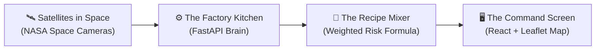

# 🏔️ TerraSharp Explained Like You're 5 Years Old! 🎈

> **"Imagine you're building the ultimate sandcastle on a steep hill, and a giant garden hose starts pouring water on it. When will it slide down? TerraSharp is the smart robot guard that warns the village before the mud slides!"**

---

## 1. What Are We Doing? (The Big Mission)

Imagine mountains where people build colorful houses and villages.  
When it rains a little bit, it's nice and cozy. 🌧️  
**BUT** when it rains for days and days, two scary things can happen:
1. **Landslides (Mudslides):** The steep mountain turns into slippery mashed potatoes and slides down! 🪨
2. **Flash Floods:** A huge wall of rushing water rushes down the valley like a giant bathtub emptying all at once! 🌊

**Our Project (TerraSharp):**  
We built a smart computer system that watches the sky and the mountains from space, calculates the danger, and tells the village leaders:  
*"Hey! The mountain is getting too slippery! Move everyone to safe high ground right now!"* 📢

---

## 2. The 4 Magic Clues We Look At 🔍

To know if a mountain is going to slide, our robot looks at **4 clues**:

```
        🌧️ Heavy Rain (35%)
                +
        📐 Steep Hill (30%)
                +
        🧽 Wet Soil Sponge (20%)
                +
        📖 History Memory Book (15%)
                = 🚨 DANGER SCORE (0 to 100%)
```

### 1. 🌧️ The Rain (From NASA Space Satellites)
- **What it is:** Space satellites flying high above the clouds measure how much water is falling from the sky.
- **Why it matters:** If it rains a tiny bit, no problem. If it rains like 1,000 buckets at once, danger goes UP!

### 2. 📐 The Hill Steepness (The Giant 3D Mountain Map)
- **What it is:** A 3D map from NASA radar that knows the height and steepness of every hill.
- **Why it matters:** If rain falls on a flat soccer field, it just makes a puddle. But if rain falls on a steep playground slide, things slide right off!

### 3. 🧽 The Soil Sponge (Our "Soil Proxy")
- **What it is:** The dirt on the mountain is like a giant sponge.
- **Why it matters:** If the sponge is dry, it can drink a lot of water. But if it has been raining for 15 days, the sponge is soaking wet and can't hold another drop! 
- *(We honestly call this a "Proxy" because we estimate it using 15 days of rain, like guessing how wet a sponge is by how long you held it under the tap).*

### 4. 📖 The Memory Book (NASA Historical Landslide Catalog)
- **What it is:** A big history book of where mountains have slid in the past 15 years.
- **Why it matters:** If a hill has slid before, its dirt is loose and it's much more likely to slide again!

---

## 3. How the Machine Works (The Architecture in Plain Words) 🏗️

Think of our system like a **Lego factory** with 4 helper stations:



### Station 1: The Space Eyes (Data Ingestion)
- Satellites look down and send numbers about rain and hills to our computer.

### Station 2: The Grid Slicer (Analysis Grid)
- Our computer cuts the whole district into little puzzle squares (about 1 kilometer wide, like a neighborhood block).
- Every single square gets its own score!

### Station 3: The Recipe Mixer (Scoring & Lead-Time)
- The computer mixes the 4 clues using our special recipe.
- It also uses a famous math rule (**Caine Formula**) to check the stopwatch:  
  *"Under this heavy rain, how many hours until the hill can't take it anymore?"* ⏱️

### Station 4: The Traffic Lights (Alert Engine)
- 🟢 **GREEN (Normal):** Everything is safe. Enjoy the rain!
- 🟡 **YELLOW (Watch):** Hill is getting wet. Keep your eyes open.
- 🟠 **ORANGE (Warning):** Very dangerous. Stop trucks on mountain roads.
- 🔴 **RED (Critical):** DANGER! Sound the simulated evacuation alarm! Move to the shelter!

---

## 4. Why Just Looking at Rain is Silly (The Playground Test) ⚽

Some older systems only checked: *"Did it rain a lot?"*

**Why that fails:**
- If it pours rain on a flat beach or flat farm field: **Zero landslides!** Just big puddles.
- If you only look at rain, you panic everyone in the flat city for no reason! (False Alarms 😫).
- **TerraSharp is much smarter:** By checking the steep slope + wet sponge + rain together, our model was **97% accurate** (ROC-AUC 0.972) and cut false alarms by more than half!

---

## 5. The Building Blocks We Used (Resources & Tools) 🧰

| Cool Tool | What it is in simple terms |
|---|---|
| **Python** 🐍 | The friendly programming language that does all the heavy thinking and math. |
| **FastAPI** ⚡ | The super-fast postal carrier that delivers hazard scores to the screen in milliseconds. |
| **React** ⚛️ | The tool that builds all the buttons, cards, and clicky panels on the website. |
| **Leaflet Map** 🗺️ | The interactive map that lets you zoom in on hills, roads, and village borders. |
| **NASA Satellites (IMERG & SRTM)** 🛰️ | The cameras in outer space giving us free maps and weather information. |
| **NASA GLC** 📚 | The historical catalog of past disasters used to test if our robot is telling the truth. |

---

## 6. Our Golden Rule: Always Tell the Truth! (Scientific Honesty) 😇

In science, you must never tell fairy tales. We have 4 honesty promises:
1. We **never** say *"A landslide will happen at 3:15 PM sharp."* We say: *"The rain is rising fast and will cross the danger line in about 2 hours."*
2. We **never** pretend we have a magic sensor in every inch of dirt. We honestly admit our soil moisture is an **Antecedent Rain Proxy**.
3. If an empty forest has no past landslide reports, we **never** assume it's 100% safe. We give it a sensible middle score so nobody gets surprised!
4. All evacuation alarms are **simulated practice warnings** so emergency teams can learn and prepare.

---

## 7. The Final Result 🏆

You can open your web browser right now to **`http://localhost:5173`**:
- You can click on real villages in Kerala (like **Mundakkai** and **Chooralmala**).
- You see the colors turn red where the mountain is steep and soaked.
- You can see exactly **WHY** the computer picked that score.
- And village leaders can look at the map and make smart decisions to keep everyone safe!
