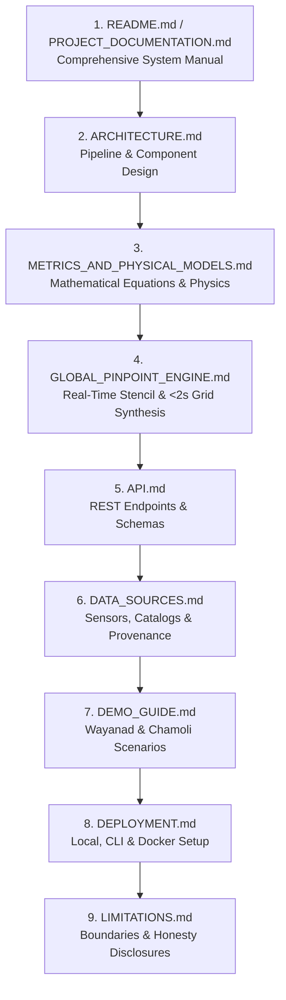

# TerraSharp Documentation Master Index

Welcome to the complete documentation index for **TerraSharp (SH-304: Hyper-Local Landslide & Flash-Flood Early Warning System)**. This directory contains comprehensive references, scientific derivations, operational playbooks, architecture diagrams, and API specifications.

---

## 🗺️ Recommended Reading Order

---

## 📚 Complete Document Catalog

| Document | File Path | Focus Area | Target Audience |
|---|---|---|---|
| **Master System Manual** | [`PROJECT_DOCUMENTATION.md`](../PROJECT_DOCUMENTATION.md) | Complete self-contained project manual (Architecture, Formulas, Live Engine, API, Benchmarks). | All engineers, evaluators, auditors |
| **System Overview & Quickstart** | [`README.md`](../README.md) | High-level introduction, key features, quickstart commands, and provenance disclosures. | General developers, evaluators |
| **System Architecture** | [`ARCHITECTURE.md`](ARCHITECTURE.md) | Data-fusion pipeline diagrams, spatial normalization, multi-provider failover, and module map. | System architects, backend engineers |
| **Mathematical & Physical Metrics** | [`METRICS_AND_PHYSICAL_MODELS.md`](METRICS_AND_PHYSICAL_MODELS.md) | Horn (1981) slope, D8 flow routing, 15-day AMI, Caine (1980) lead-time, false-alarm mitigation gate. | Data scientists, geologists, hydrologists |
| **Global Pinpoint & Grid Engine** | [`GLOBAL_PINPOINT_ENGINE.md`](GLOBAL_PINPOINT_ENGINE.md) | 30m coordinate stencil, live rainfall extraction, multi-provider failover, and sub-2-second grid generator. | GIS engineers, fullstack developers |
| **REST API Reference** | [`API.md`](API.md) | Full endpoint specifications, parameters, request/response JSON schemas, and status codes. | Frontend developers, API integrators |
| **Data Sources & Provenance** | [`DATA_SOURCES.md`](DATA_SOURCES.md) | Inventory of NASA GPM IMERG, SRTM 30m DEM, NASA GLC, Survey of India, and soil proxy disclosures. | Remote sensing analysts, GIS specialists |
| **Scientific Limitations** | [`LIMITATIONS.md`](LIMITATIONS.md) | Operational boundaries, proxy disclosures, non-guarantee statements, and false alarm discussions. | Disaster managers, reviewers, evaluators |
| **Interactive Demo Guide** | [`DEMO_GUIDE.md`](DEMO_GUIDE.md) | Step-by-step walkthrough of Wayanad (monsoon deluge) and Chamoli (Himalayan relief) scenarios. | Operators, demonstrators, evaluators |
| **Deployment Guide** | [`DEPLOYMENT.md`](DEPLOYMENT.md) | Local Python/Node setup, Docker containerization, docker-compose, and environment variables. | DevOps, system administrators |
| **Explain Like I'm 5 (ELI5)** | [`EXPLAIN_LIKE_IM_5.md`](EXPLAIN_LIKE_IM_5.md) | Super-simple, fun explanation of the entire system, sandcastle analogy, 4 clues, and architecture. | Non-technical stakeholders, students |

---

## 🔬 Scientific & Provenance Quick Reference

All data layers in TerraSharp strictly declare their physical provenance:

- **`OBSERVED`**: Primary physical measurements (e.g. cadastral boundaries, historical inventory points).
- **`DERIVED`**: Geometrically or mathematically computed from primary data (e.g. Horn 3x3 Slope, D8 Flow Accumulation).
- **`PROXY`**: Indirect empirical indicators (e.g. Antecedent Moisture Index based on 15-day rainfall decay; never claimed as direct in-situ sensor data).
- **`MODELLED`**: Weighted hazard index outputs (Landslide Risk, Flash-Flood Concentration).
- **`ESTIMATED`**: Dynamically projected forward in time under current rainfall intensification (Caine 1980 threshold lead time).
- **`DEMO`**: Offline reproducible historical scenarios (Wayanad July 2024 and Chamoli February 2021).
